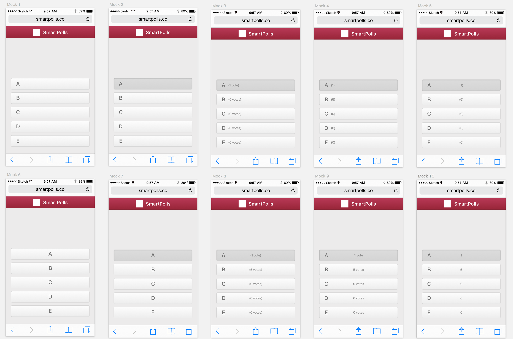
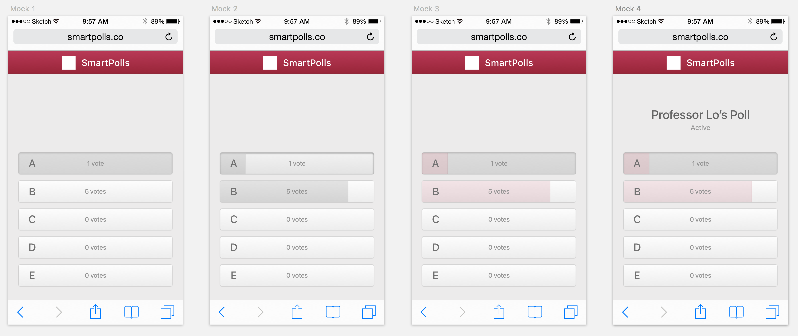

# First Design Spec

After discussion, the "simple" concept discussed in the [initial case study](./CASESTUDY.md) was agreed to be the most compelling. The first component to be mocked up is the mobile voter experience. Since the voting experience is very simple, it should be the easiest part to tackle. The color scheme that was chosen is one that for the most part matched the [MIT Brand Colors](http://web.mit.edu/graphicidentity/colors.html). The reason for this color selection is because the initial users will be MIT students, and the product should feel as comfortable as possible. Our first users are the most important.. and also our only users. We should do what we can to make our first users like the product as much as possible.

## Run 1

- Mocks 1 and 2 show the initial structure for the voting experience, one with an option selected.
- Mocks 6 and 7 show an alternate structure with the text centered.
- Mocks 3-5 and 8-10 show explorations for the display of vote counts.

Ultimately, Mock 9 was chosen to continue designing upon, because it visually makes the most sense, with the possibility that Mock 6 and 7 could be used if no vote count will be shown to the voter.

## Run 2

It's possible to display the percentage number in text on each button, but it's more expressive to utilize the screen area to represent the percentage.

- Mock 1 is carried over from Run 1.
- Mock 2 shows the space of the button representing the percentage of voters who selected that option.
- Mock 3 adds the use of color.
- Mock 4 adds the poll information.

Mock 4 works great, and will be carried through to the next runs.