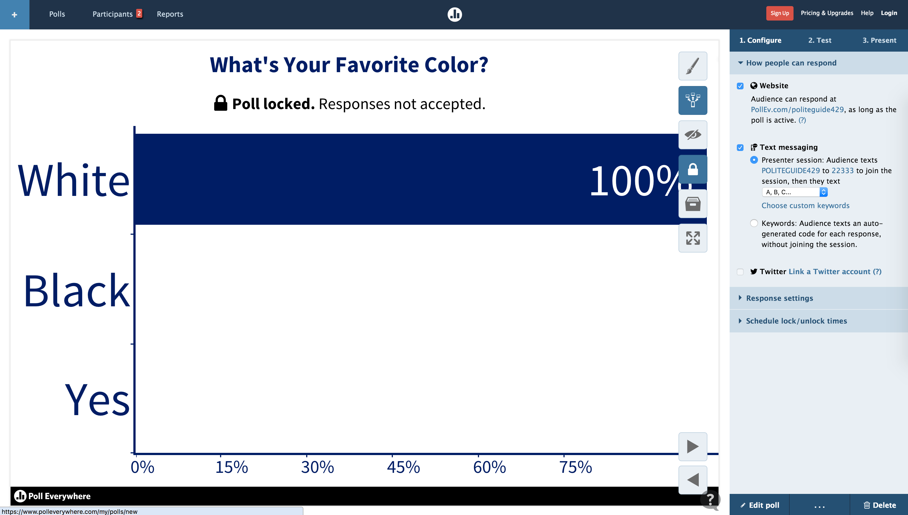
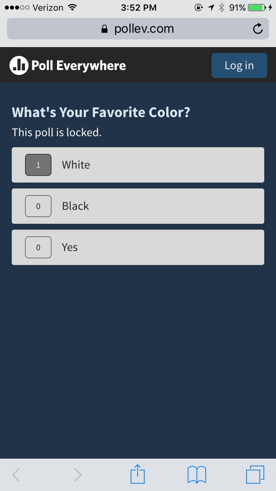
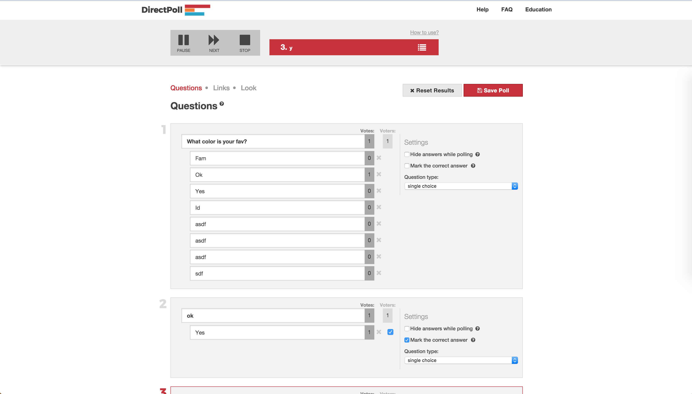
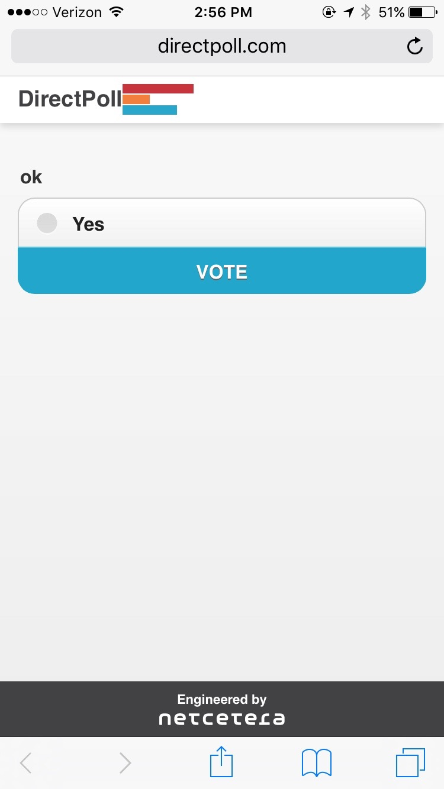
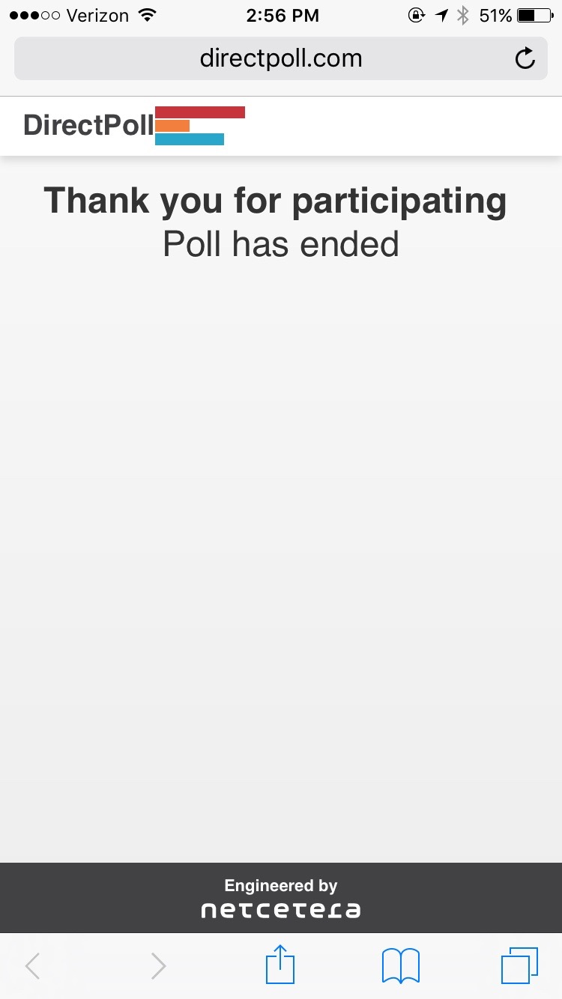
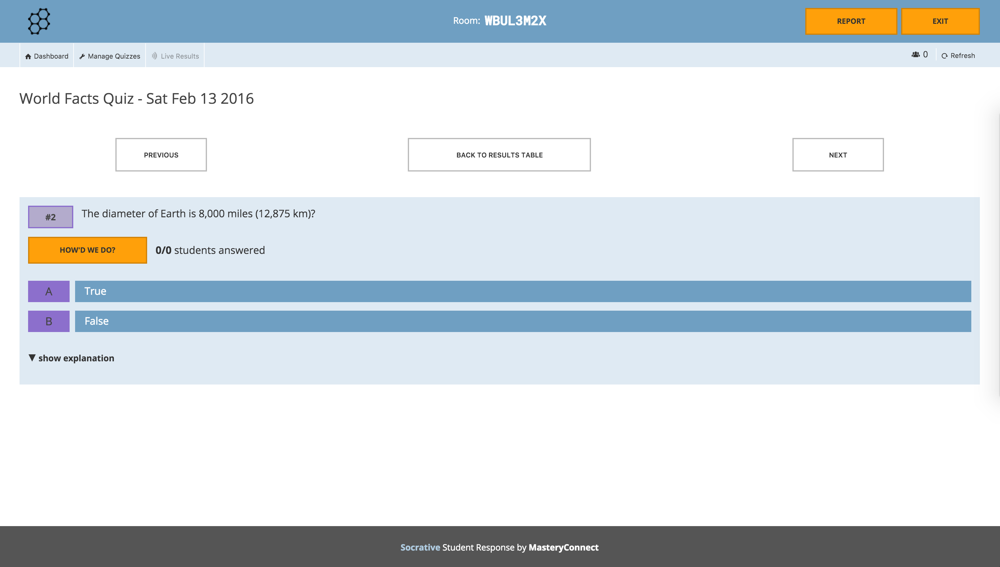
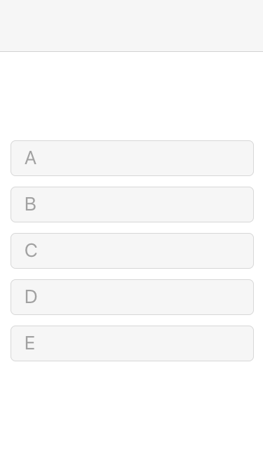
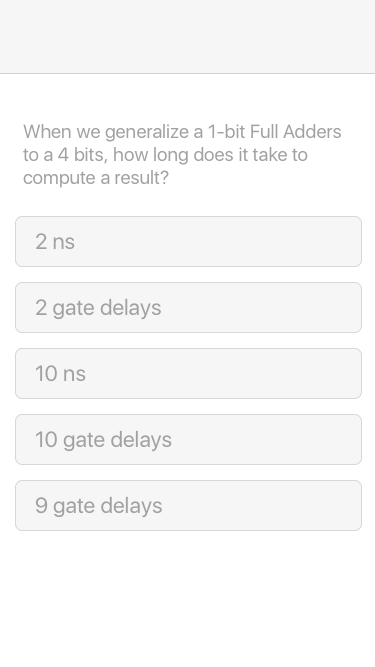

# Initial Design Case Study

The primary use case for Smartpolls is in the classroom setting. It should allow a course instructor to easily create a poll that students can access through any device with a web browser. Ideally, the interactions for voting should happen in real-time, displaying the poll results live to the instructor and all of the students. The instructor can then reveal the answer to all of the students, and reset the system, ready to move on to the next question. To better understand the best solution to the problem, some analysis should be done on existing alternative offerings:

## [Poll Everywhere](https://www.polleverywhere.com/)

Poll Everywhere is a good, popular solution to learn from. The application runs very swiftly and every interaction is updated almost instantaneously. However, the layout of the application is very confusing. On first look, all of the controls seem cluttered and tacky. Part of the unintuitiveness is owed to poor padding and having too many available actions. The primary actions (set active, lock poll, ...) are represented by ambiguous icons placed in easy-to-miss buttons. Smartpolls should be clearer, less feature rich, and better layed out. This will allow a new course instructor to have a very small learning curve and very quickly make polls without having to figure things out. Smartpolls will benefit from a linear poll creation process, unlike Poll Everywhere, whose process is very complex and unexplanatory.

Poll Everywhere's mobile voting experience is much better. The voting experience benefits from a stripped-down interface. Voters simply access the webpage and vote on the question they see, while the page updates automatically as the instructor changes to the next poll. The interface also updates very snappily to any update the instructor makes to the poll, like locking the poll for example.

Smartpolls should be just as responsive as Poll Everywhere but with a simpler feature set and simpler UI layout, directing users toward just one very polished polling experience.

## [DirectPoll](http://directpoll.com/)

DirectPoll's instructor poll creation really shines as a result of its function clarity. At first exposure to the website, users can rely on their sensibilities to guide them to effectually create polls. The process is easily understandable. However, the slideshow structure of the poll, coupled with the ability to edit polls at any time makes it very unclear if the poll is actually active and what exactly voters are seeing. Smartpolls should emulate the simplicity of DirectPoll's poll creation process.

The slideshow aspect of DirectPoll is affirmed in their voting interface. This makes the poll feel more like a quiz and detracts from the "live"-ness of the poll. Smartpolls voters should not be redirected away from the poll once they vote, they should stay on the same poll until it is completed.

## [Socrative](http://www.socrative.com/)

There is not much good in Socrative. Very poor use of space.

## Key Takewaways

Through investigating the structure and function of different offerings, some observations are made clear about Smartpolls:

- **Very Few Controls:** Smartpolls should have a minimally sufficient feature set, structured in a linear format to allow first-time course instructors to understand what they're doing from the start.

- **Fast Update Rates:** Poll interactions should feel instantaneous. The faster votes are registered, the more voters will "feel" like they are really contributing.

- **Unmistakeably Easy to Vote:** Voters should just navigate to the webpage and need to do nothing else afterwards except vote. The page should update and redirect automatically, allowing the voter to not have to worry about being having done something wrong. As long as the voter is still on the page, then they have nothing to worry about.

## Product Brainstorms

### Simple

The first and simpler of the options for the product is to have merely a polling system. This closesly models the iClicker system where instructors show the poll question and list the options themselves and voters choose one of five choices.

##### Pros
- Keeps the focus on the lecture instead of on the phone, because the questions are shown only in the lecture itself, not the phone.
- Very little pre-lecture preparation work needed for the instructor. No need to create custom questions for every lecture. Just click one button in preparation for the lecture to create a new poll.
- Faster to build.

##### Cons
- Less organized results records. The poll results will not be labeled in any manner and will look almost indistinguishable from each other.
- Small degradation in polling experience.

### Customized

Another option for the product is to have a more customized polling system, like Poll Everywhere or DirectPoll.

##### Pros
- Clearer to voters what they are voting on.
- Better record for the instructors what the poll results were.

##### Cons
- Directs attention away from the lecture and onto the phone.
- Increased complexity and preparation for the sake of redundant information.

## Conclusion

The "simple" product concept seems to be the better option. Without the extra, redundant specificity of the polls, Smartpolls becomes less of a "live quiz" application and more of a "poll session" application. The added level of indirection allows the system to be used easily in a much wider variety of scenarios - not just in the classroom, but also in college organization voting, or gauging a large group's general consensus during a convention. It requires much less work on the poll creators part and will be a lot faster to make.

