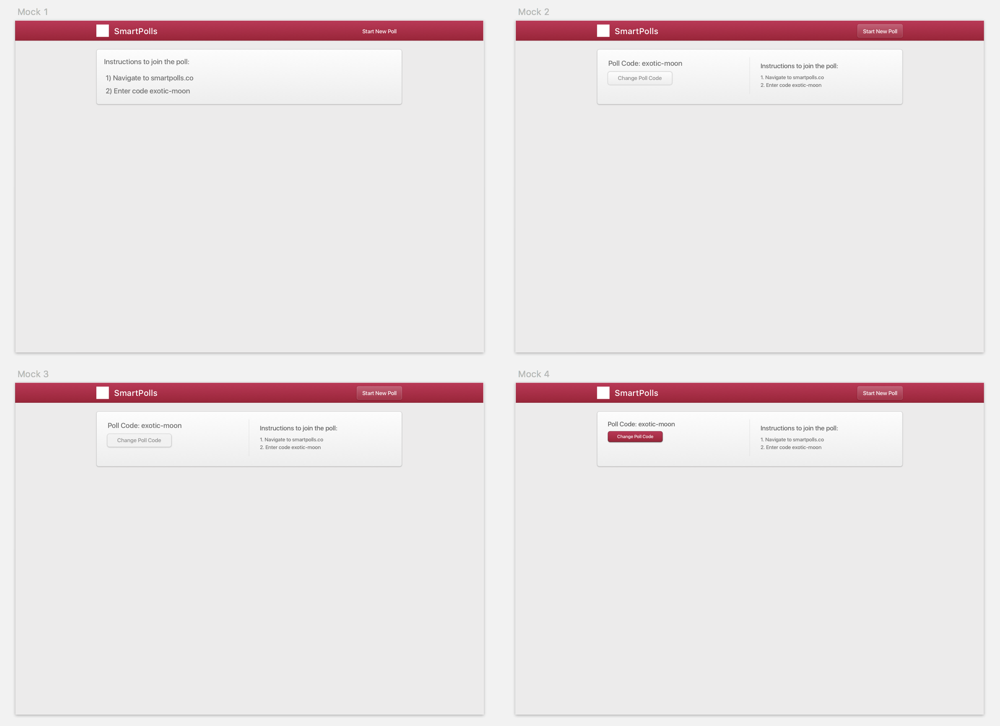
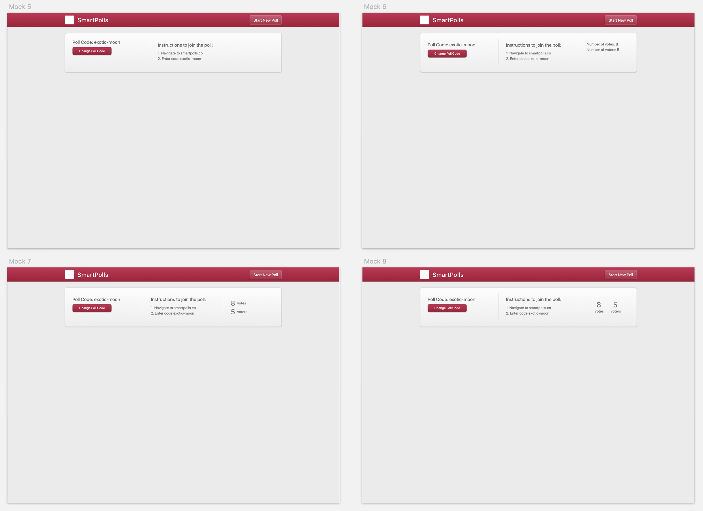
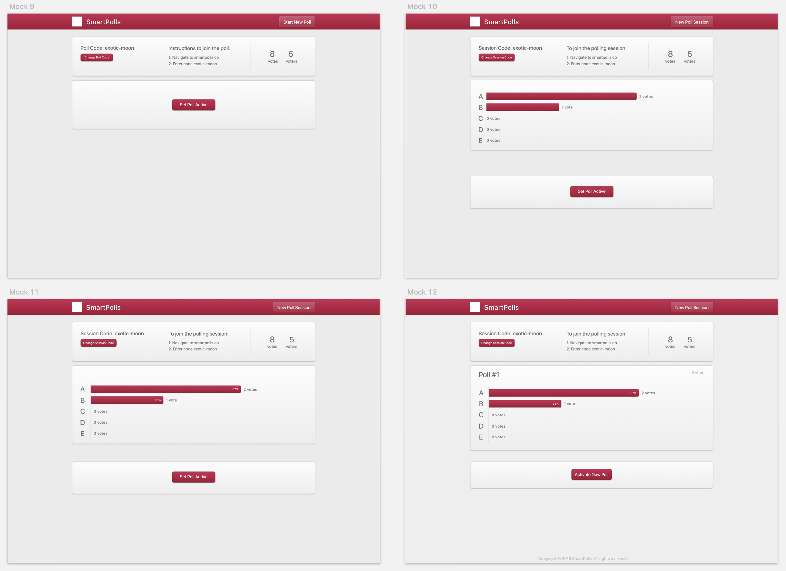
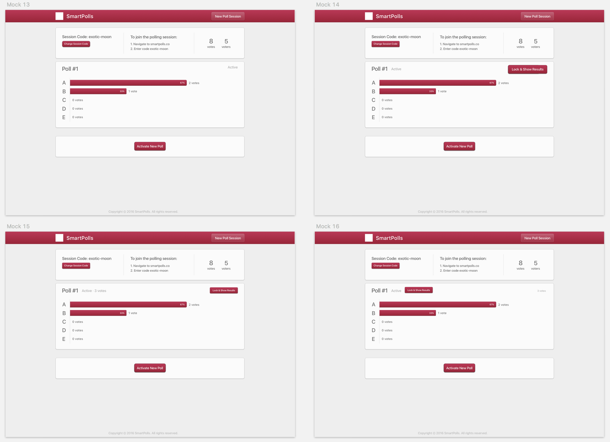
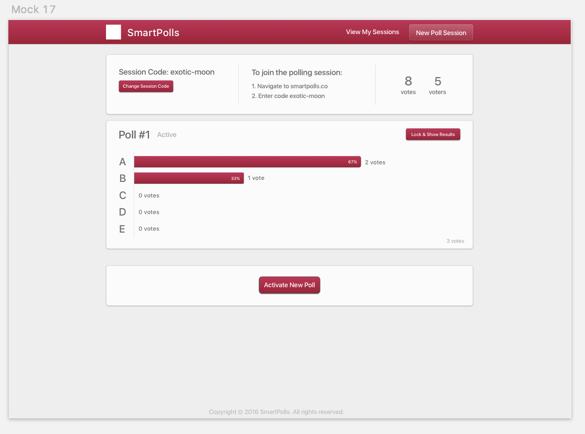

# Second Design Spec

After mocking up the voting experience in [the first design spec](./FIRSTSPEC.md), the designs can shift now to the poll creation experience. We can make the assumption that poll creators will most often use their computer to set up polls, because they are using their computer to prepare and present their lecture slides.

##### There are a few different ways to generate poll identifiers:

1. A random sequence of numbers and lower-case letters: *(eg. lzx32)*
    - Not many permutations. 3 letters and 2 digits have 1.7 million permutations, making collisions likely after many polls have been created.
    - Random sequences are relatively hard to remember.

2. A random sequence of numbers and upper-case letters: *(eg. UOi84)*
    - About 10x as many permutations. 3 letters and 2 digits have 14 million permutations.
    - Even more difficult to remember.

3. A random phrase consisting of one adjective and one noun in the english dictionary *(eg. windy-sun)*
    - Not too many permutations. Around 1.5 million permutations depending on the package used. This can be resolved with bucketing - if windy-sun is taken, then take windy-sun2
    - Easy to remember.
    - The code is much longer, meaning there are more characters to type.

On first judgement, option 3 seems the best. This can be revisited later, but option 3 provides codes that are significantly easier to remember. You can hear see the code once and be able to type the whole thing without a problem. You can even hear the code once and type in the code without any problem. To prevent the codes from becoming too long, we can restrict by a maximum number of letters or number of syllables.

##### There are a few different ways to handle poll identifiers:

1. A unique code for each poll:
    - More in line with how our brains think. If there is another poll you want to connect to, even if it is owned by the same person, you type a different code for the different poll.
    - More inconvenient for repeat poll sessions.

2. A unique code for each user:
    - More convenience for repeat voters and poll owners. The same link would be used the whole semester, voters could just bookmark the same link for use later.
    - There may, however unlikely, be some funky business by people who have access to the link from previous sessions. This could be more of a problem for users who create polls for a number of convention speeches. The same code would be used for all of the poll sessions.
    - Could cause confusion for poll creators. Since the same code is used for all of their polls, they may not know which poll their voters are connecting to. Which of my polls is active again?

The pitfalls for option 2 are too plentiful to confidently move ahead with that option. Thus, option 1 is the option that makes the most sense.

## Run 1

The poll creation process should be linear - the poll owner will be able to start recording a poll and stop recording. Then, immediately move on and start recording another poll. We can further simplify the process by disallowing the poll owner from returning back to a previously completed poll. This will minimize the number of possible actions and make the interface as understandable as possible - only providing the actions that poll makers really need.

From the mobile voting design spec, cards kind of unknowingly became the design language of Smartpolls. So they are carried over to the voting experience. Each poll should have common information displayed about it besides the poll data. All of this data will be shown in one place in a card at the top of the page.

- Mocks 1-4 show different layouts of some poll information.
- Mocks 2-4 show the ability to change the poll codes.

## Run 2

- Mocks 5-8 show more variations for displaying the poll information.

## Run 3

A distinguishment should be made between a group of polls and a singular poll to the user to avoid confusion, but also for the purposes of this document. Previous runs called a group of polls a "poll" and a singular poll also a "poll". But really, a more accurate term for the group of polls is a "session". However, when possible, we should label it to the user as "poll session", because session can mean a myriad of different things to the user. A session that I use my computer without restarting? But it makes more sense to describe that voters need to type in the unique code to participate in the "poll session".

- Mock 9 shows how a new poll will be started. After the button is clicked, the card will transition into the poll data card.
- Mocks 10-12 shows the visualization of the poll data graphs.

The poll data should include the number of votes for each choice, the percentage of votes each option received, the total number of votes, and then poll's number.

## Run 4

##### There are a few options for poll voter-results dynamics.

1. Show voters the results when the poll owner is ready to reveal them, like iClicker:
    - Adds a level of suspense for the voters, who are curious how they compare to other voters. And all voters see the final results together simultaneously.
    - Voters are encouraged to guess what they believe without any external bias, because none is provided until the votes are locked.

2. Show voters the results after voting:
    - Provides immediate feedback to voters.
    - Negatively affects results by including an external bias. This could be addressed by disallowing changing votes, but disallowing people to change their vote has negative consequences; it would enforce accidental touches and obviate retroactive realizations.

3. Show voters results before voting:
    - The strongest influence from negative bias.
    - Could be useful for the game of trying to get the group to balance all options equally. But not for much else.

Option 1 is the most useful and conceivably would bethe considerably most common option. However, there are scenarios where the other two options make more sense, but are they worth adding an extra action paradigm to the product? And are they worth spending the time to building in the first product? Perhaps option 2 may be in the future, but the answer for both at this moment is almost certainly no.

The gradient background on the cards is a bold aesthetic, but may be too strong. After stumbling across this [simple demo](http://chenglou.me/react-motion/demos/demo8-draggable-list/), it has become clear that it may be better to tone the aesthetic a little to prevent distracting from the actually important information on the card. Also, the gradient card is already used for clickable buttons, which could confuse users if used on cards that are not clickable.

- Mock 13 shows another layout possibiility for displaying the information.
- Mocks 14-16 shows the inclusion of a "Lock Button".

The mocks in this run show the more subtle card effect.

## Run 5

- Mock 17 shows another layout visualization of the poll data.

Mock 17 works great, and will be carried through to the next specs.